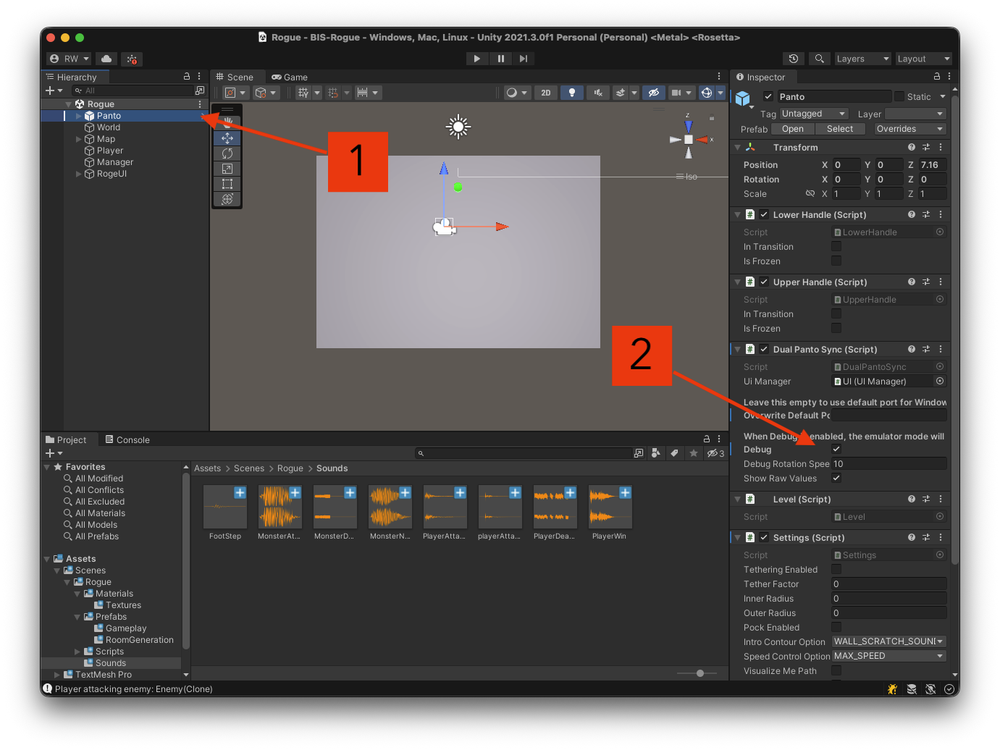

# DualPanto-Rogue

Unity Version: **2021.3.0f1**

## Resources

- [Rogue Gameplay Online](https://archive.org/details/RogueTheAdventureGameV1.11984MichaelC.ToyKennethC.R.C.ArnoldAdventureRolePlayingRPG#loading)
- [DualPanto Toolkit](https://github.com/HassoPlattnerInstituteHCI/unity-dualpanto-toolkit/) - Installation and Documentation

___

## Getting Started

##### ⚠️ Enable Panto-Debug-Mode

> **💡 Tip:**
> When pressing Play, Unity shows a brown screen. Press **"b"** on your keyboard to make the scene visible.

## Rogue Gameplay 🎮

### Step-by-Step Tutorial

**1. Add Player and Keyboard Controls**
   - 1.1 Create a capsule in the scene (right-click in the Hierarchy window → 3D Object → Capsule/Sphere)
  
   - 1.2 Rename the GameObject to "Player"
  
   - 1.3 Change size of the GameObject in the Inspector (click on GameObject → right window → change values inside scale)
  
   - 1.4 Attach the `PlayerController.cs` script to the Player GameObject **(ToDo)** (click on the GameObject → scroll down the Inspector window → click add component)
  
   - 1.5 Test movement using the arrow keys (press play on center top)
  

**2. Add Collectible Food Items**
   - Create a capsule in the Hierarchy and rename it to "Food"
   - Add a Capsule Collider component to the Food GameObject
   - Create a new Tag called "Food":
     - Select the Food GameObject
     - In the Inspector, click on the Tag dropdown (below the GameObject name)
    
     - Select "Add Tag" and create "Food"
    
    
    
     - Assign this tag to the Food GameObject
    
   - In the Inspector, go to the capsule collider and select **isTrigger**
   
   - Add a Rigidbody to the Player GameObject and select isKinematic
   
   
   - Edit the `PlayerSimple.cs` script to handle collisions **(ToDO)**
   - 🖼️(Placeholder for todo)

**3. Create Room**
   - The Map GameObject already includes a Mesh Collider (required for collision detection)
   - Create a 3D Cube inside the Map GameObject (right-click on Map GameObject in Hierarchy → 3D Object → Cube)
   - Scale and position the cube to form a room that contains the Player
   - Remove the `PlayerController.cs` script from the Player
   - Attach the `PlayerControllerCollision.cs` script to the Player GameObject **(ToDo)**
   - This enables proper collision detection between Player and Map
   

**4. Add Enemy with Movement**
   - Create an enemy GameObject similar to the Food item
   - Create and assign a new Tag called "Enemy"
   - Attach the `EnemyMovement.cs` script to make the enemy follow the Player **(ToDo)**
    

**5. Create Prefabs and Random Spawning**
   - Attach the `RoomSpawnRandom.cs` script to the Map GameObject **(ToDo)**
   - Create multiple rooms (they should either overlap or be connected by corridors)
   
   - Create and assign the Tag "Room" to each room where you want spawning to occur
   - Create Prefabs:
     - Navigate to the Prefabs folder in the Project window
     - Drag the Enemy and Food GameObjects from the Hierarchy into the Prefabs folder
     
     - The objects should turn blue, indicating they are now prefab instances
     
     - Delete the Enemy and Food instances from the Scene
     - Select the Map GameObject and locate the `RoomSpawnRandom.cs` component
     - Drag the Enemy prefab into the "Enemy Prefab" field and drag the Food prefab into the "Food Prefab" field
     

**6. Add Procedural Map Generation**
  - Remove all manually placed rooms inside the Map
  
  - Add the `GridRoomSpawner.cs` script to the Map GameObject
  
  - Configure the spawner in the Inspector:
    - Select the **Room Prefab** (drag from Prefabs folder or use the object picker)
    - Select the **Corridor Prefab** (drag from Prefabs folder or use the object picker)
    - Adjust **Rows** and **Columns** for grid size (e.g., 3x3)
    - Set **Min/Max Room Size** (controls room dimensions within each cell)
    - Adjust **Probability of Room in Cell** (percentage chance a cell contains a room)
  - Press **Play** to generate a random dungeon layout with connected rooms

___
#### Game Sounds

1. sound (application with a blind scene -> just audio output) -> different branche
2. add walking sound to handle
3. add soundmanager to game

8. room speech on entry -> SpeechIO???

___
#### DualPanto Haptics

1. add unity handle to game -> move to position, move around with unity handle
2. add player recoil when player collides with enemy

### meeting ideas

- Food before room collision (done)
- dumb enemy??? (do we need dumpEnemy or just use SmartEnemy and set room to infinity) (done)
- GameManager (done)

### nice to have
- spawn player at spawn point

### TODO until Bis:
- GamePlay
  - write a todo
  - finish readme
- GameSounds Repo (all scripts ready)
  - write a readme
  - document the scripts
  - write a todo
- DP Repo with all scripts
  - write a readme
  - document the scripts
  - write a todo

- delete scripts
- insert images
- github classroom???
- how to handle random game object position when spawning??? must be at y = 1

### other ideas
- script viewer dp

  