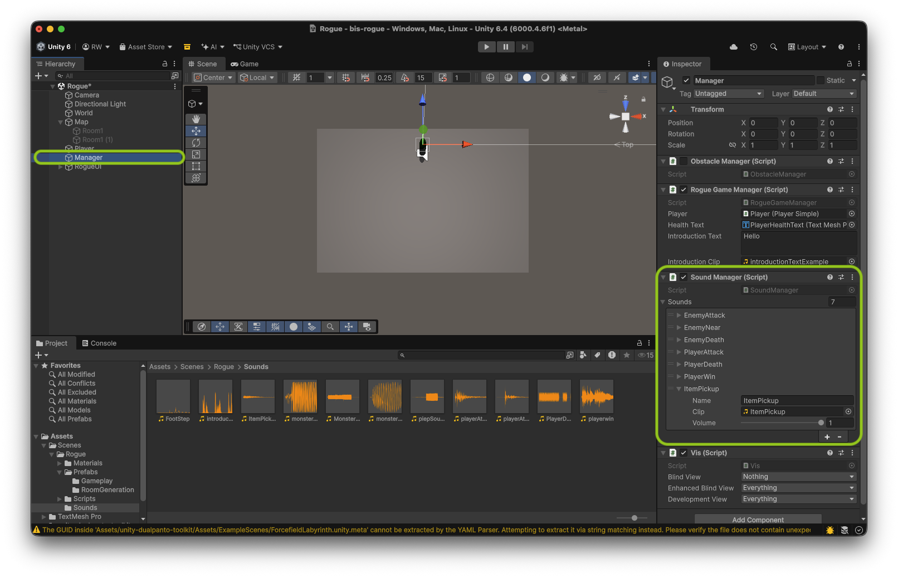
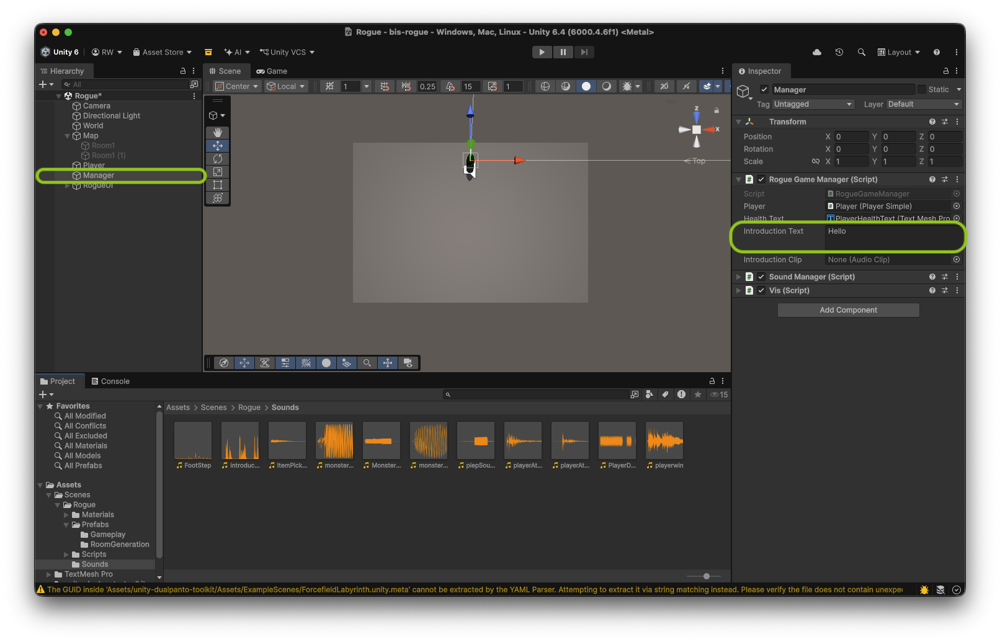
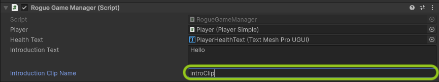

# DualPanto-Rogue
Unity Version: **6000.3.17f1**

## Resources

- [Rogue Gameplay Online](https://archive.org/details/RogueTheAdventureGameV1.11984MichaelC.ToyKennethC.R.C.ArnoldAdventureRolePlayingRPG#loading)
- [DualPanto Toolkit](https://github.com/HassoPlattnerInstituteHCI/unity-dualpanto-toolkit/) - Installation and Documentation

___

## Getting Started

> **💡 Tip:**
> When pressing Play, Unity shows the screen. Press **"b"** on your keyboard to make the scene invisible.

## Rogue Sounds 📣

### Step-by-Step Tutorial

#### 0. Check

- 0.1: Have you run `git submodule update --init --recursive` on this repository?

#### 1. Add ItemPickupSound to SoundManager
   - Select the Manager in the Scene and go to SoundManager. There you will find a List of Sounds.
     - Press `+` and give the sound a name (e.g. "ItemPickupSound", "HealSound").
     - Add a sound clip to the item
      
  - Now we need to play the sound when a player picks up an item.
     - **TODO**: go to `PlayerSimple.cs` and edit the TODO.

#### 2. Text-To-Speech
   - Select the Manager in the Scene and go to RogueGameManager. 
    - Enter a text (introductionText) you want to hear when starting the game
      
     - **TODO**: go to `RogueGameManager.cs` and edit the TODO.

#### 3. TTS for every room
   - Every room has a `RoomSpeechOnEntry` component, which speaks its `introductionText` (via TTS) when the player enters.
   - **TODO**: go to `GridRoomSpawner.cs` and uncomment the line that sets `introductionText = $"Room {roomData.id}"` on each spawned room.
   - Press Play and walk into a room. You should hear "Room \<id\>" announced when you enter.
 
#### 4. Speech Audio Clip
- go to [luvvoice.com](https://luvvoice.com) or take your phone and create an audio introduction clip (mp3, wav)
- import the sound into Unity by dropping it inside the Assets view. 
- Add the clip to the SoundManager and give it a name.
  
- Select the manager in the scene again and add the name for the clip in the RogueGameManager.
 
  

