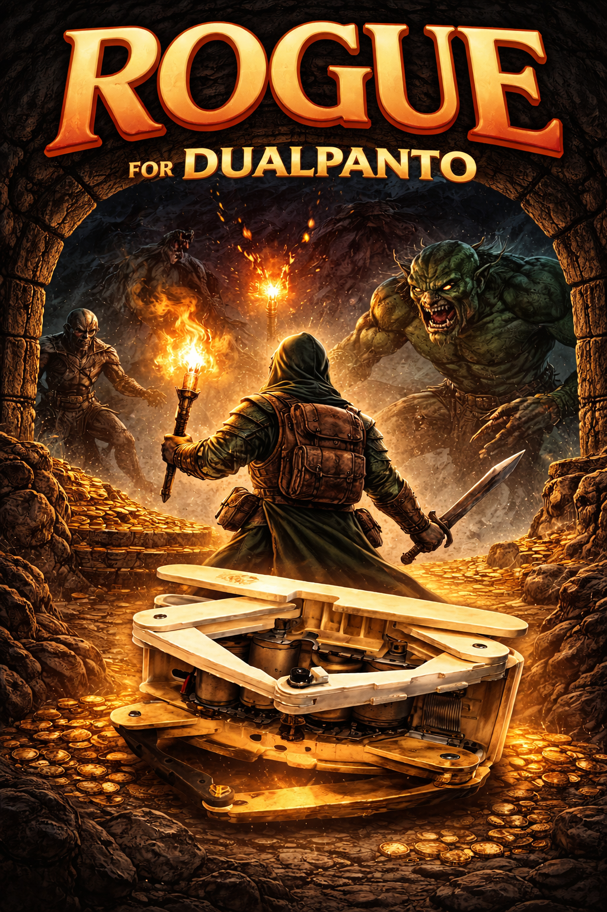

# DualPanto-Rogue
Unity Version: **6000.3.17f1**

## Resources

- [Rogue Gameplay Online](https://archive.org/details/RogueTheAdventureGameV1.11984MichaelC.ToyKennethC.R.C.ArnoldAdventureRolePlayingRPG#loading)
- [DualPanto Toolkit](https://github.com/HassoPlattnerInstituteHCI/unity-dualpanto-toolkit/) - Installation and Documentation

___

## Getting Started

> **💡 Tip:**
> When pressing Play, Unity shows the screen. Press **"b"** on your keyboard to make the scene invisible.

## Rogue Haptics 🦾

### Step-by-Step Tutorial

#### 0. Check

- 0.1: Have you run `git submodule update --remote --recursive` on this repository?

#### 1. Connect the Player to the Me-Handle

   - Select the **Player** in the Scene.
   - Remove the `PlayerControllerCollisions.cs` script from it.
   - Add the `MeHandle.cs` script in its place.
   - Press Play and move the Me-Handle (the upper handle). The player should move with it.

   **Connection problem?**
   1. Select the **Panto** GameObject and verify that *Debug Mode* is disabled and the correct port is set.
   2. If everything looks correct but it still doesn't connect, unplug the panto and plug it back in, or press Play a few more times.
   3. Still stuck? Ask a TA or check the [DualPanto Toolkit](https://github.com/HassoPlattnerInstituteHCI/unity-dualpanto-toolkit/) installation and documentation.

#### 2. Render the room walls (PantoCompoundCollider)

   - Select the **Map** and add the `PantoCompoundCollider.cs` script. Check **On Upper**.
   - Press Play, wait for the scene to load, then press `E` to render the walls.

   **Walls not rendering?**
   1. While playing, the walls should appear as a black line. If they don't, check the panto collider you attached: is the right handle checked, are the Unity collider and panto collider set correctly, and is `isPassable` set to `false`?
   2. If that still doesn't work, check the **Manager** GameObject and confirm `ObstacleManager.cs` is attached.

   **Walls render but the panto doesn't move?**
   - Check that the battery is inserted, charged, and that the panto's power switch (on the back) is turned on.
   - Still stuck? Ask a TA or check the [DualPanto Toolkit](https://github.com/HassoPlattnerInstituteHCI/unity-dualpanto-toolkit/) installation and documentation.

#### 3. Move the enemy with the It-Handle

   - The enemy is controlled nearly similar as before, just with the position of the handle and a logic to get the handle to each enemy.
   - Before starting, read up on the panto handle commands in the [DualPanto Documentation](https://github.com/HassoPlattnerInstituteHCI/unity-dualpanto-toolkit/blob/develop/Documentation/documentation.md).
   - **TODO:** Open `EnemyMovement.cs` and complete the `TODO` inside.

#### 4. Add player recoil

   - Select the **Player** and attach the `PlayerRecoil.cs` component.
   - **TODO:** Open `PlayerRecoil.cs` and complete the `TODO` inside.

